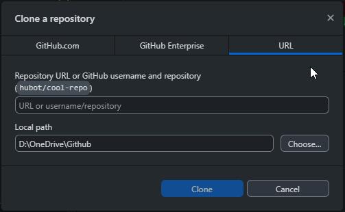
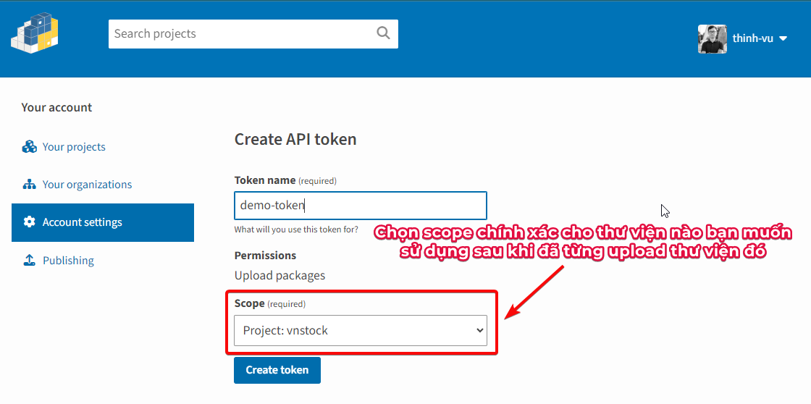
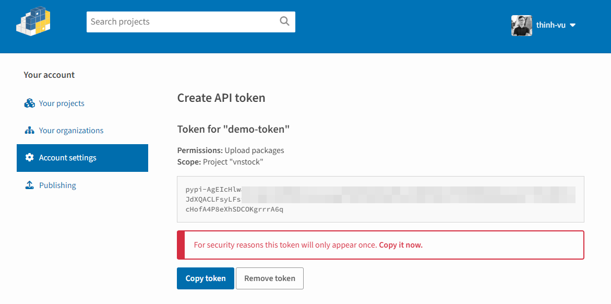
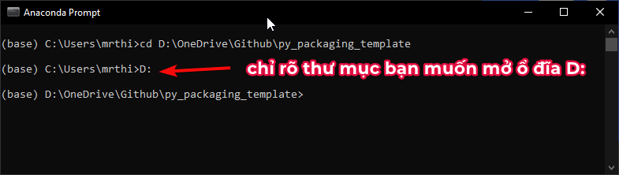
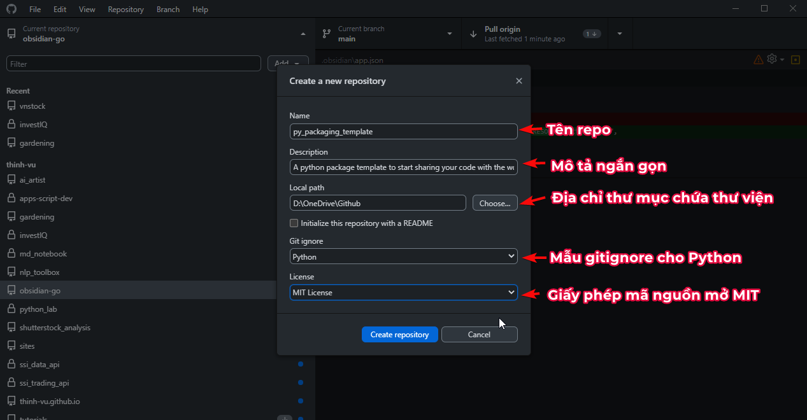
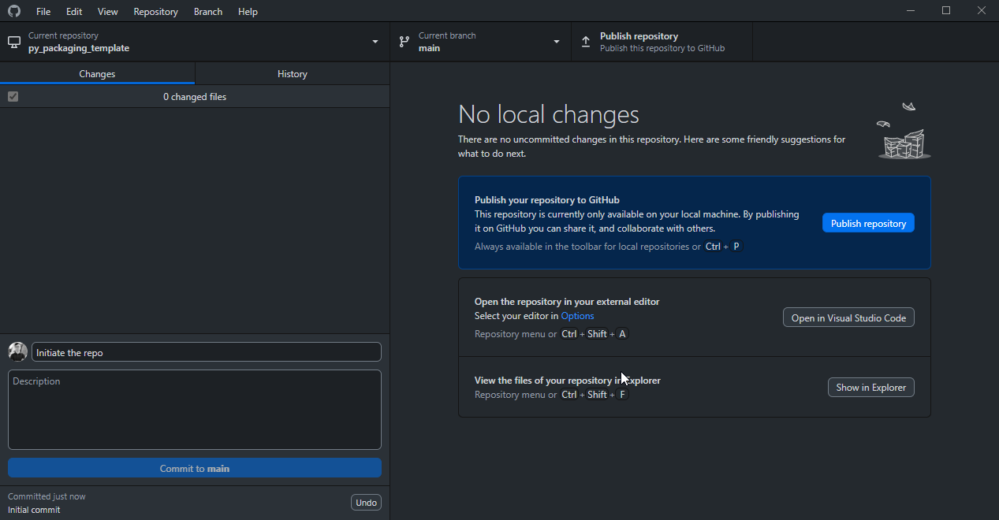
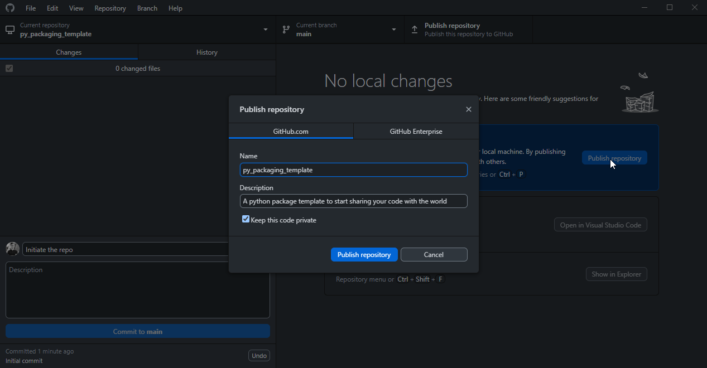

> Tham khảo bài viết chi tiết trên Thinh Vu Blog và video hướng dẫn trên kênh Youtube LEarn Anything [tại đây](https://thinhvu.com/2023/08/13/huong-dan-dong-goi-python-package-pypi/)

---

# I. GIỚI THIỆU CHUNG

> `py_packaging_template` là một repo chứa cấu trúc mẫu của một thư viện Python, giúp cho những người dùng mới tìm hiểu về cách tạo một thư viện Python bắt đầu một cách đơn giản và nhanh chóng để chia sẻ dự án của mình với cộng đồng.

Nội dung hướng dẫn được tham chiếu từ tài liệu đóng gói một thư viện Python chuẩn của tổ chức Python Software Foundation [Tại đây](https://packaging.python.org/en/latest/tutorials/packaging-projects/)

## Danh mục nội dung
- [I. GIỚI THIỆU CHUNG](#i-giới-thiệu-chung)
  - [Danh mục nội dung](#danh-mục-nội-dung)
  - [Lan toả repo này tới nhiều người hơn](#lan-toả-repo-này-tới-nhiều-người-hơn)
- [II. CẤU TRÚC \& MÔ TẢ VIỆN PYTHON MẪU](#ii-cấu-trúc--mô-tả-viện-python-mẫu)
- [III. HƯỚNG DẪN SỬ DỤNG](#iii-hướng-dẫn-sử-dụng)
  - [3.1. Clone template repo vào tài khoản Github](#31-clone-template-repo-vào-tài-khoản-github)
  - [3.2. Clone repo này về máy của bạn](#32-clone-repo-này-về-máy-của-bạn)
    - [a.Sử dụng Terminal / Command Prompt](#asử-dụng-terminal--command-prompt)
    - [b. Sử dụng Github Desktop](#b-sử-dụng-github-desktop)
    - [3.3. Cập nhật mã nguồn của bạn vào thư viện](#33-cập-nhật-mã-nguồn-của-bạn-vào-thư-viện)
    - [3.4. Thiết lập thư viện](#34-thiết-lập-thư-viện)
    - [3.5. Chuẩn bị các công cụ cần thiết](#35-chuẩn-bị-các-công-cụ-cần-thiết)
    - [3.6. Đóng gói thư viện](#36-đóng-gói-thư-viện)
    - [3.7. Kiểm thử thư viện](#37-kiểm-thử-thư-viện)
    - [3.8. Phân  phối thư viện lên Pypi](#38-phân--phối-thư-viện-lên-pypi)
    - [3.9. Chia sẻ mã nguồn lên Github](#39-chia-sẻ-mã-nguồn-lên-github)
- [IV. 🙋‍♂️ THÔNG TIN TÁC GIẢ](#iv-️-thông-tin-tác-giả)
- [V. ỦNG HỘ TÁC GIẢ](#v-ủng-hộ-tác-giả)

## Lan toả repo này tới nhiều người hơn
- Nếu bạn thấy bài hướng dẫn này hữu ích, hãy góp phần lan tỏa nó tới bạn bè và cộng đồng để nhiều người có cơ hội tiếp cận hơn.
- Các hình thức lan tỏa và ủng hộ tinh thần cho `py_packaging_template` bao gồm nhưng không giới hạn
  - Đánh dấu yêu thích dự án trên Github với tính năng `Star` ở trên
  - `Folk` dự án để bắt đầu tùy biến lại hướng dẫn cho mục đích sử dụng cá nhân của bạn trong tổ chức/lớp học.
  - Theo dõi và chia sẻ cảm nghĩ của bạn qua bình luận trên Youtube channel của tác giả, bao gồm hướng dẫn trực quan bằng video [LEarn Anything](https://www.youtube.com/@learn_anything_az).

# II. CẤU TRÚC & MÔ TẢ VIỆN PYTHON MẪU

> Nội dung của thư viện này được copy từ cấu trúc một thư viện khác mà tôi chia sẻ tên là `ur_gadget` để bạn có thể hình dung thực tế 1 thư viện chứa những thông tin chính xác như thế nào. Thư viện này cũng đã được chia sẻ lên Pypi và Github.

Thư viện mẫu này bao gồm các thành phần sau:
```
py_packaging_template/
├─.gitattributes
├─.gitignore
├─code/
│ ├─datetime_intel.py
│ ├─gadget.py
│ └─__init__.py
└─src/
  └─github_desktop_clone.png
├─LICENSE
├─README.md
├─pyproject.toml
├─setup.cfg
├─requirements.txt
```
trong đó:

- `code/` chứa các file mã nguồn của thư viện

- `src/` chứa các file tài nguyên đính kèm bao gồm hình ảnh, video, tài liệu hướng dẫn, ...

- `LICENSE`: chứa thông tin về giấy phép sử dụng thư viện, trong trường hợp này là giấy phép MIT.

- `README.md`: chứa thông tin về thư viện, cách cài đặt và sử dụng thư viện, đây là file người dùng đọc trước khi cài đặt thư viện và được hiển thị mặc định khi bạn chia sẻ thư viện lên Pypi.

- `pyproject.toml`: cho biết các công cụ quản lý thư viện như `pip` và `build` sẽ sử dụng thêm các gói thư viện nào để tạo các gói thư viện của bạn khi người dùng cài đặt vào máy của họ. Bạn cần chỉ rõ các gói thư viện phụ thuộc (dependencies) trong file này. Hướng dẫn này sử dụng `setuptools` để tạo gói thư viện.

- `setup.cfg`: chứa các thông tin cấu hình cho thư viện như tên thư viện, tác giả, phiên bản, ...

- `requirements.txt`: chứa các gói thư viện cần thiết để phát triển thư viện, trong trường hợp này là `setuptools` và `wheel`. Bạn có thể chỉ rõ các gói thư viện khác nếu cần thiết, thông thường khi bạn tham chiếu một thư viện python không có sẵn khi cài đặt Python, bạn cần chỉ rõ các gói thư viện này trong file này để người dùng cài đặt thư viện này mới có thể sử dụng thư viện của bạn.

# III. HƯỚNG DẪN SỬ DỤNG

## 3.1. Clone template repo vào tài khoản Github
> Sử dụng cách này, anh em clone trực tiếp repo này như 1 template repo vào tài khoản Github của mình. Sau đó có thể lập trình tiếp với Github codespace hoặc clone về máy tính để lập trình với IDE như Visual Studio Code.


Bạn có thể chọn cách này hoặc bỏ qua và thực hiện từ bước 2.2.

## 3.2. Clone repo này về máy của bạn

> Trong hướng dẫn này, bạn có thể clone dự án về máy của mình thông qua 2 cách là dùng Terminal/Command Prompt hoặc Github Desktop. 

### a.Sử dụng Terminal / Command Prompt

1. Mở Terminal/Command Prompt
2. Di chuyển đến thư mục bạn muốn lưu trữ dự án với lệnh `cd ĐƯỜNG_DẪN_TỚI_THƯ_MỤC`. Ví dụ: `cd C:\Users\thinh\Github\` 
3. Clone dự án về máy của bạn với lệnh `git clone https://github.com/thinh-vu/py_packaging_template.git`

Chờ một lát, bạn sẽ thấy một thư mục mới được tạo ra với tên `py_packaging_template` bên trong thư mục bạn chọn để lưu trữ dự án.

### b. Sử dụng Github Desktop

> Nếu bạn chưa từng sử dụng Github Desktop, bước đầu tiên cần làm là cài đặt Github Desktop trên máy tính và đăng nhập với một tài khoản Github. Bạn có thể tải Github Desktop tại [đây](https://desktop.github.com/). Sử dụng Github (và Git nói chung) là một cách không thể thiếu để quản lý mã nguồn của bạn.

1. Mở Github Desktop

2. Chọn `File` > `Clone repository`
3. Paste link của repo vào cửa sổ hiện ra và chọn thư mục lưu trữ dự án để tiếp tục


### 3.3. Cập nhật mã nguồn của bạn vào thư viện
- Bạn cần tạo các file mã nguồn của thư viện, ví dụ ở đây là `gadget.py` và `datetime_intel.py` trong thư mục `/code`
- Thiết lập tham chiếu các file mã nguồn này trong file `__init__.py`.
  - Thêm các dòng code để import các thành phần của thư viện vào file `__init__.py`. Ví dụ: `from .gadget import *` để import toàn bộ các phần tử (hàm, biến, vv) từ file `gadget.py` vào thư viện. Mỗi file mã nguồn sẽ có một dòng import tương ứng. 
  - `.gadget` là tên file mã nguồn (chính là file gadget.py), vì file này đặt cùng thư mục với file `__init__.py` bạn đang thiết lập nên dùng dấu `.` để tham chiếu.

### 3.4. Thiết lập thư viện

1. `setup.cfg`: Thay đổi thông tin mô tả thư viện của bạn như tên, phiên bản, tác giả, email, loại giấy phép, URL mã nguồn ...
2. `pyproject.toml`: 
  - Mục [build-system] không cần thay đổi.
  - Mục `[project]`:
    - `name` và `description` là tên và mô tả ngắn gọn gói thư viện được tạo ra để làm gì.
    - `version` là số hiệu phiên bản của gói phần mềm, khi chia sẻ lên Pypi, bạn cần tăng số hiệu phiên bản này lên 1 đơn vị so với phiên bản trước đó. Ví dụ: phiên bản trước đó là `0.0.1` thì phiên bản mới sẽ là `0.0.2`. Số hiệu này là duy nhất trên Pypi, nếu bạn cố tình tạo ra một phiên bản trùng với phiên bản đã có trên Pypi, bạn sẽ nhận được thông báo lỗi. Sau khi đã upload thư viện thành công lên Pypi, bạn có thể xóa thư viện nhưng không thể dùng lại số hiệu phiên bản đã được sử dụng đó.
    - `dependencies`: các gói phụ thuộc được sử dụng trong thư viện của bạn, tên mỗi gói được viết một dòng, phân cách nhau bởi dấu phẩy `,`. Trong trường hợp này, bạn cần thêm 2 gói thư viện là `trafilatura` là gói phụ thuộc không có sẵn khi cài python. 
3. `README.md`: Cung cấp mô tả về thư viện và hướng dẫn sử dụng để người dùng tham chiếu. File này sẽ được hiển thị mặc định khi bạn chia sẻ thư viện lên Pypi và Github.
4. `LICENSE`: Chứa thông tin về giấy phép sử dụng thư viện, trong trường hợp này là giấy phép MIT. Bạn có thể tham khảo các giấy phép khác tại [đây](https://choosealicense.com/licenses/). MIT là loại giấy phép phổ biến nhất và được sử dụng rộng rãi trong cộng đồng mã nguồn mở. Bạn có thể yên tâm sử dụng giấy phép này cho thư viện của mình mà không cần làm gì thêm.
5. `requirements.txt`: Chứa các gói thư viện cần thiết để cài đặt thư viện của bạn, trong trường hợp này là `setuptools`, `wheel` và `trafilatura`. Bạn có thể chỉ rõ các gói thư viện khác nếu cần thiết, thông thường khi bạn tham chiếu một thư viện python không có sẵn khi cài đặt Python, bạn cần chỉ rõ các gói thư viện này trong file này để người dùng cài đặt thư viện này mới có thể sử dụng thư viện của bạn.

### 3.5. Chuẩn bị các công cụ cần thiết
- Cài đặt công cụ `build` để đóng gói thư viện: Sử dụng câu lệnh `pip install --upgrade build` hoặc `python3 -m pip install --upgrade build` hoặc `python -m pip install --upgrade build` tùy thuộc vào môi trường python bạn đang sử dụng là macOS/Linux hay Windows.
- Cài đặt công cụ `twine` để upload thư viện lên Pypi: Sử dụng câu lệnh `pip install --upgrade twine` để cài đặt, nếu gặp lỗi, thử đặt `python -m ` hoặc `python3 -m ` trước câu lệnh trên.
- Tạo tài khoản [PypiTest](https://test.pypi.org) để thử nghiệm upload thư viện và [Pypi](https://pypi.org) để upload chính thức. Sau khi tạo tài khoản, bạn cần tạo một API token bằng cách mở mục [Account Setting](https://pypi.org/manage/account), tìm mục `API tokens` và chọn `Add API tokens`. Tại đây bạn chọn scope, nếu là lần đầu tiên tạo token thì chỉ cần chọn scope mặc định, áp dụng cho toàn bộ account của bạn, khi đã chia sẻ ít nhất 1 thư viện, bạn có thể chọn scope chính xác cho thư viện đó để bảo mật tài khoản, giới hạn phạm vi tác động của API tới chính xác thư viện bạn muốn làm việc. PypiTest là bản sao của Pypi để bạn làm quen và thử nghiệm trước khi tải chính thức. 
Khi mới làm quen với việc chia sẻ thư viện, bạn nên bắt đầu với PypiTest, sau khi Test (kiểm thử) hoàn chỉnh và xác thực thư viện bạn có thể chạy hoàn hảo cho người dùng tải về thì có thể chuyển sang chia sẻ chính thức tại Pypi.



### 3.6. Đóng gói thư viện

1. Mở Terminal/Command Prompt từ thư mục chứa thư viện của bạn. Sử dụng `cd ĐƯỜNG_DẪN_TỚI_THƯ_MỤC` để di chuyển đến thư mục chứa thư viện của bạn như ở bước 2.1.

2. Bắt đầu đóng gói khóa học với lệnh `python -m build` trong Terminal/Command Prompt


### 3.7. Kiểm thử thư viện

- Upload thư viện lên PypiTest. Tiếp tục chạy câu lệnh sau với Terminal/Command Prompt `python -m twine upload --repository testpypi dist/*`. Bạn sẽ thấy trong Terminal/Command Prompt yêu cầu cung cấp `username` và `password`.
	- Nhập `__token__` cho username
	- Nhập token của PypiTest bạn đã tạo ở bước trước cho `password`
- Sau khi upload thành công bạn sẽ nhận được thông báo trong Terminal/Command Prompt.
- Chờ một lát, bạn đã có thể bắt đầu kiểm tra quá trình cài đặt thư viện mình đã chia sẻ. Có nhiều kịch bản kiểm tra, ở đây tôi xin giới thiệu 3 kịch bản phổ biến cho 3 hệ điều hành Linux, Windows, và macOS. 
	- Linux: Cài đặt thử thư viện của bạn trên Google Colab
	- Windows: Cài đặt thử thư viện của bạn trong môi trường Python bạn có, ví dụ Anaconda. Lưu ý: Nếu bạn cài Anaconda python thì cần kiểm thử với Anaconda prompt hoặc chọn đúng runtime khi chạy với IDE như Visual Studio Code.
	- macOS: Cài đặt thư viện với Terminal và cài đặt thử thư viện.
- Xác nhận các hàm trong thư viện có thể hoạt động: Bạn nên có sẵn 1 Jupyter Notebook, file `.ipynb` để chạy toàn bộ hàm cần kiểm tra và xác nhận không có lỗi nào xảy ra.
- Nội dung kiểm tra:
	- Các gói phụ thuộc (dependencies) có được tự động cài đặt đầy đủ khi cài thư viện của bạn không? Có cần chạy câu lệnh cài dependencies với file requirements.txt hay không? `python -r requirements.txt`
	- import thư viện như thế nào thì thành công? import từng module có hoạt động không?
	- Các hàm có hoạt động đúng như thiết kế không?
	- Docstring (phần hướng dẫn nhập các tham số của hàm) có hiển thị thân thiện và đầy đủ không?
	
### 3.8. Phân  phối thư viện lên Pypi
> Các bước thực hiện khi phân phối thư viện của bạn chính thức trên Pypi tương tự như với bản `PypiTest`, khác chút ở câu lệnh upload, cần thay thế `testpypi` thành `pypi`. Cụ thể như dưới đây.

- Upload thư viện lên PypiTest. Tiếp tục chạy câu lệnh sau với Terminal/Command Prompt `python -m twine upload --repository pypi dist/*`. Bạn sẽ thấy trong Terminal/Command Prompt yêu cầu cung cấp `username` và `password`.
	- Nhập `__token__` cho username
	- Nhập token của PypiTest bạn đã tạo ở bước trước cho `password`

Các bước kiểm tra cần được thực hiện thêm 1 lần nữa với bản chính thức này, tương tự như với PypiTest để đảm bảo thư viện hoạt động hoàn hảo.

Chúc mừng bạn đã trở thành tác giả của 1 thư viện python mã nguồn mở 🤩

### 3.9. Chia sẻ mã nguồn lên Github
Sau khi thực hiện hoàn tất các bước trên, thư viện của bạn đã sẵn sàng. Hãy hoàn tất quá trình này bằng 1 bước nữa đó là chia sẻ mã nguồn của bạn lên Github nếu bạn thực sự muốn công khai mã nguồn dự án. Để làm điều này, bạn có thể sử dụng Github Desktop để `commit` và đẩy mã nguồn lên tài khoản Github của bạn. Bước này có thể thực hiện trước khi phân phối thư viện của bạn lên Pypi để có thể lấy thông tin URL của dự án và đặt vào phần thông tin tác giả/mã nguồn trong file `setup.cfg`
- 
- 
- 

# IV. 🙋‍♂️ THÔNG TIN TÁC GIẢ

Thịnh Vũ là một chuyên gia trong lĩnh vực Digital Marketing với 8+ năm kinh nghiệm, anh đam mê lĩnh vực phân tích dữ liệu/lập trình với Python và ứng dụng rộng rãi trong công việc của mình. Đồng thời anh là tác giả của thư viện `vnstock` sử dụng trong phân tích dữ liệu chứng khoán Việt Nam được cộng đồng sử dụng rộng rãi. Anh chia sẻ kinh nghiệm và hiểu biết của mình một cách có hệ thống và dễ hiểu tới cộng đồng thông qua Blog [thinhvu.com](https://thinhvu.com) và kênh Youtube [LEarn Anything](https://www.youtube.com/@learn_anything_az?sub_confirmation=1). Bạn có thể kết nối với Thịnh qua các kênh sau:

<div id="badges" align="center">
  <a href="https://www.linkedin.com/in/thinh-vu">
    
  </a>
  <a href="https://www.messenger.com/t/mr.thinh.ueh">
    
  <a href="https://www.youtube.com/@learn_anything_az?sub_confirmation=1">
    
  </a>
  </a>
    <a href="https://github.com/thinh-vu">
    
  </a>
</div>

---

# V. ỦNG HỘ TÁC GIẢ

Nếu bạn nhận thấy giá trị từ các dự án mã nguồn mở của Thịnh, bạn có thể hỗ trợ phát triển chúng bằng cách quyên góp hoặc đơn giản là gửi tặng tôi một ly cà phê để cảm ơn.
Bạn có thể chọn 1 trong 3 hình thức đóng góp bao gồm Momo, Chuyển khoản ngân hàng và Gửi tiền qua Paypal. Sự đóng góp của bạn sẽ giúp tôi duy trì phí lưu trữ blog và tiếp tục tạo ra nội dung chất lượng cao. Cảm ơn sự ủng hộ của bạn!

- [Paypal](https://paypal.me/thinhvuphoto?country.x=VN&locale.x=en_US)

- 

- 